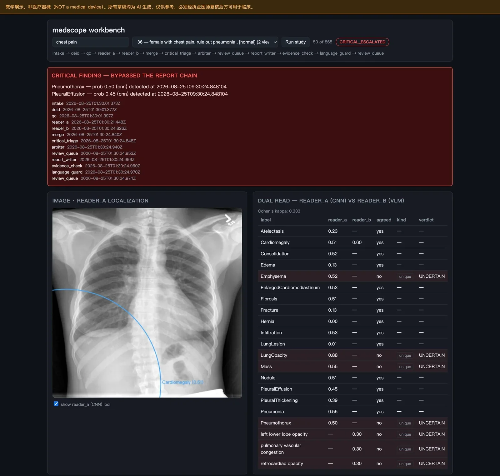
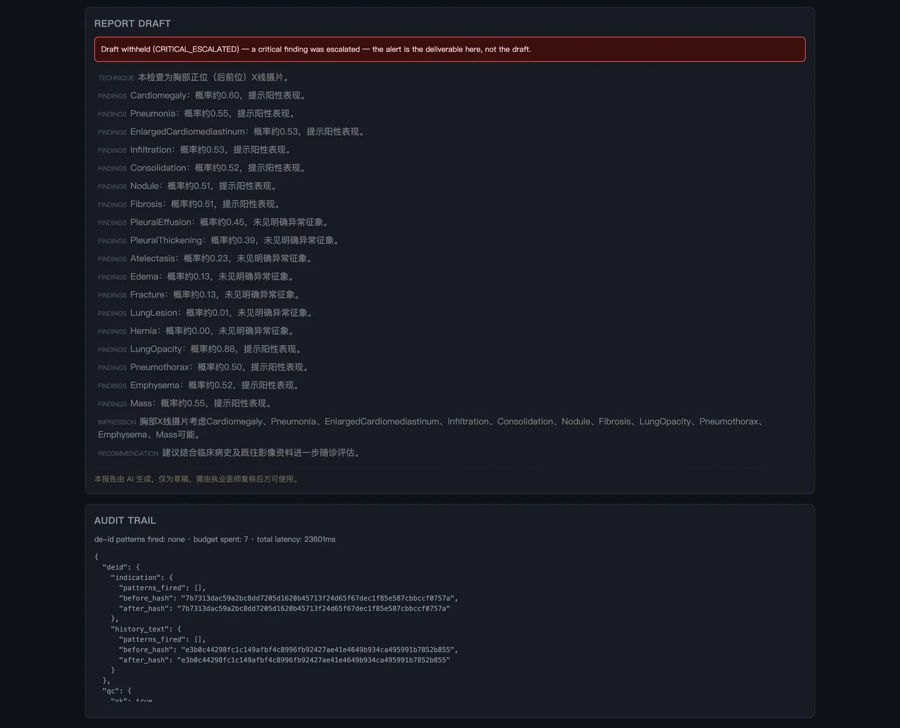

<div align="center">

# 🩻 medscope

**医生端胸片阅片副驾** —— 异质双读一裁（CNN × VLM，失效模式正交）· 危急值旁路抢报 · 每句结论挂证据(硬门) · PHI 0 泄漏(硬门) · 诊断口径红线(硬门) · 六套件 eval 门禁 · 零构建工作台悬停即溯源

[](#-许可证)
[](https://www.python.org/)
[](https://fastapi.tiangolo.com/)
[](https://github.com/mlmed/torchxrayvision)
[](https://langchain-ai.github.io/langgraph/)
[](https://github.com/QwenLM/Qwen3-VL)
[](https://langfuse.com/)
[](.github/workflows/ci.yml)
[](#-评测)
[](#-评测)
[](#-评测)

「武道AI / AI Engineering Dojo」**以阵制胜**系列 · 阵 05 · 高风险域里，把「测不准」写在门上而不是藏进指标

</div>

---

> **教育演示项目，非医疗器械。** 不用于临床诊断，不用于任何真实诊疗决策。
> 数据全部来自公开去标识数据集（NLM Open-i / Indiana University 胸片集），不接触任何真实患者数据。
> 系统只产出**报告草稿**，签发权永远在执业医师。

`medscope` 取自放射科真实术语 **second reader（第二读片者）**——既是架构隐喻，也是定位声明：AI 是第二个读片的人，不是主诊医生。

输入一张胸片 + 既往病历文本 + 检查申请单，输出一份**每句结论都挂着证据**的结构化报告草稿，外加一条独立的危急值告警通道。

<details>
<summary><div align="center"><b>👇 点击此处，展开完整截图</b></div>
</summary>

</details>

<p align="center"><sub><b>workbench 跑一例危急值</b> —— 红框是抢在报告之前发出的气胸告警，中间是 <code>reader_a</code>（CNN）与 <code>reader_b</code>（VLM）的逐标签对照与 kappa；往下是被扣住不发的报告草稿，以及每一步的脱敏 before/after 哈希与预算消耗。</sub></p>

**这个仓库最值钱的部分不是那些绿灯，是 [🔍 诚实的局限](#-诚实的局限)。** `make eval` 现在是 **PASS**，G1 危急值召回 27/27。这盏绿灯只值它背后那一句话：**召回从 22/27 升到 27/27 的同时，误报率一动没动**（两次都是 21/26 = 0.808）。改的是系统去看哪些像素——读全一份研究的每一张片、不再把肺尖和肋膈角裁掉——而不是「多低才算报警」。气胸 AUC 仍然只有 0.659，这个数必须和绿灯一起读，否则它就是又一盏焊死的绿灯。详见 [G1 是怎么变绿的](#g1-是怎么变绿的以及这盏绿灯不代表什么)。

## 📑 目录

- [✨ 特性](#-特性)
- [🏗️ 架构](#️-架构)
- [🧱 技术栈](#-技术栈)
- [🚀 快速开始](#-快速开始)
- [💬 使用示例](#-使用示例)
- [📊 评测](#-评测)
- [🔍 诚实的局限](#-诚实的局限)
- [🔒 安全](#-安全)
- [🔭 可观测](#-可观测)
- [📁 项目结构](#-项目结构)
- [🧩 配置](#-配置)
- [🗺️ 路线图](#️-路线图)
- [📄 许可证](#-许可证)

## ✨ 特性

- 🔬 **异质双读一裁（招牌）** —— 直接搬自放射科真实的双读制 SOP。`reader_a` 是判别式 CNN（TorchXRayVision DenseNet-121），出**定量概率 + Grad-CAM 定位**但读不懂临床语境；`reader_b` 是生成式 VLM **看原图独立读片**，能结合病史推理、能描述标签集之外的征象但不给校准概率。两者**失效模式正交**，所以分歧不是要抹平的噪声，而是「这张片上有一处需要人看」的精确指针。这也是与同质 Jury（多个同构模型投票）的本质区别。
- 🎞️ **读的是 study，不是文件** —— 放射科医生读的是一份研究的全部投照，不是文件夹里第一个文件。`reader_a` 对每张片各推理一遍、逐标签取最大，并**把结论归属到看见它的那一张片**上；读片顺序由 `views.py` 从像素与文件名算出，与操作系统枚举顺序无关。这一条直接把 G1 从 22/27 抬到 27/27，而 FPR 不变。归属不是装饰：在侧位片上算出的 Grad-CAM 画到正位片上，是一个自信的错误标注。
- 🚨 **危急值旁路抢报** —— `triage()` 与报告撰写**并行**跑，不等报告写完就告警，照搬医院的 critical results communication 制度。用 `critical_threshold=0.3` 而非报告阈值 0.5：**漏一例气胸可能致命，多报一例只花医生三十秒**，这个非对称是刻意的，且召回与误报率**永不合并成 F1**。
- 📎 **无证据不出句（硬门）** —— 报告里每一句话都必须引用一个带 `source` / `prob` / `locus` 的 `Finding`；零引用句在图里由 `evidence_check` 处理（重试一次再剥离），不是在写作层偷偷丢掉。工作台上悬停任一句话，图上对应区域与证据卡同时高亮。
- ⚖️ **仲裁器自己也看图** —— 只看两个读者的结论 + 指南散文，等于拿先验重新掂量断言，那不是仲裁而是复读。`arbiter` 走 `chat_with_image`，prompt 明确要求「根据图上所见判断」；且**只在分歧项上花 LLM 预算**（`max_llm_judgments` 封顶）。预算实测几乎每份研究都会打满，所以**顺序即决策**：先仲裁「两个读者都对同一标签表了态」的冲突，再轮到单方命名的——后者一条不丢，只是排后。
- 🔒 **PHI 0 泄漏（硬门）** —— 先写**合成 PHI 注入器**再写脱敏器，顺序反了 G4 就是恒真断言（Open-i 本身已去标识，拿它验脱敏是重言式）。注入器沿命名维度做组合生成，2000 种子扫描零泄漏。
- 📐 **诊断口径红线（硬门）** —— 输出层拦截确诊式表述、强制免责声明，并在 14 例夹具上同时量**拦截率**与**误伤率**——只量拦截率的话，一个把所有句子都拦下的护栏能拿满分。
- 🧪 **每道硬门都有一个已被演示过的失败方式** —— 五道门各配一个「故意打断实现 → 门必须变红」的非重言性测试。写这些破坏测试的过程本身就抓出过一个指标测错对象的 bug（见[评测](#-评测)）。
- 🔌 **离线优先** —— 仓内含 3 例样本切片，**克隆即可零 key 零网络跑通全流程**：`OfflineVLMClient` 替身 + 本地哈希 embedder + 内存 store。真实后端（SiliconFlow VLM / Langfuse / SQLite）config-gated 懒加载。
- 🖥️ **零构建工作台** —— 单文件 HTML，五块可解释面板（双读对照 / 分歧与仲裁 / 证据溯源 / 危急值时间线 / 门禁状态）+ SSE 逐节点流式。

## 🏗️ 架构

```text
胸片 + 检查申请单 + 既往病历文本
   │
   ▼
输入护栏（无图像 → 阻断 GUARDRAIL_BLOCKED；注入只记录、不阻断阅片）
   │
   ▼
deid 脱敏（DICOM 标签白名单 + 文本 PHI 规则 · G4 硬门）
   │
   ▼
qc 图像质控 ─▶ 分辨率过低 / 无信号 → NEEDS_REPEAT 终止（侧位仅软告警）
   │
   ├──▶ reader_a（CNN · 读全部视图 · 18 类概率 + Grad-CAM）─┐
   └──▶ reader_b（VLM · 看主视图独立读片）                  ─┤  prompt 互不含对方任何输出
   │                                          │
   ▼                                          ▼
merge 合并（分歧分三类 + 标记是否在比对词表内 + 窄/宽双 kappa）
   │
   ├──旁路──▶ critical_triage 危急值分诊 ──▶ 抢在报告之前告警（G1 硬门）
   │
   ▼
arbiter 仲裁（只跑分歧项 · 自己看图 + 指南 RAG · max_llm_judgments 封顶）
   │
   ▼
report_writer 四段草稿（技术 / 所见 / 印象 / 建议，逐句挂证据 id）
   │
   ▼
evidence_check ─▶ 有零引用句 → 重试一次 → 仍有则剥离（G2 硬门）
   │
   ▼
language_guard 诊断口径红线 + 免责声明强制（G3 硬门）
   │
   ▼
review_queue ─▶ 报告草稿 + 证据链 + 危急值时间线 → 执业医师签发
```

- **异质双读**（`readers/` + `merge.py` + `views.py`）—— CNN 出数不懂语境，VLM 懂语境不出数，**失效模式正交**。两个读者看到的图也不对称：`reader_a` 读整份研究的全部投照，`reader_b`（以及仲裁器、报告撰写）只看主视图——这是成本取舍，写在这里而不是留给别人从 trace 里发现。`tests/test_reader_independence.py` 断言 reader_a 的任何输出都不得出现在 reader_b 的 prompt 里，`describer` 降级模式下依然独立。
- **一裁**（`arbiter.py`）—— 只看两个读者的结论 + 指南散文，等于拿先验重新掂量断言；仲裁器走 `chat_with_image` **自己看图**，prompt 明确要求「根据图上所见判断，而非重新掂量两读者报告的概率」。
- **危急值旁路**（`critical.py`）—— 不依赖报告存在、不依赖 `merge_reads`、不等仲裁：一个只有单读者叫阳性的危急标签必须立刻告警，所以它拿的是两读者的**原始 findings** 而非合并后的一致项。
- **比对范围按标签集收窄**（`ontology.COMPARISON_LABELS`）—— 只在两个读者都能开口的标签上算一致性，词表外的分歧标 `in_vocabulary=False`，一条不丢但排在仲裁队列后面。窄、宽两个 kappa 并列上报，理由见[诚实的局限](#按标签集收窄假设被自己的数据否掉了)：收窄让数字更难看了，改动留下的是别的东西。
- **降级分支是正式设计**（`READER_B_MODE`）—— `kappa < 0.4 或 分歧率 > 40%` 时 reader_b 从「独立读者」降为「描述生成器」（判定权归 CNN，仲裁语义改为「描述是否支持 CNN 判定」），两种模式都有测试覆盖。
- 整条流水线由 **LangGraph** 编排（条件路由 + 并行旁路 + evidence 重试回环），三层护栏 `input` / `process` / `output` 横切全程。

## 🧱 技术栈

| 层 | 选型 | 说明 |
| --- | --- | --- |
| 视觉 reader_a | **TorchXRayVision** `densenet121-res224-all` | 18 类概率 + Grad-CAM；类目数从 `model.pathologies` **运行时读取**，禁止硬编码 |
| 视觉 reader_b | **Qwen3-VL-32B-Instruct**（SiliconFlow，OpenAI 兼容） | 看图独立读片；离线时降级为 `OfflineVLMClient` 替身 |
| 编排 | **LangGraph** | 条件路由 + 危急值并行旁路 |
| 服务 / 工作台 | **FastAPI** + 单文件 HTML + SSE | 零构建，无打包步骤 |
| 配置 | **pydantic-settings** | 裸变量名（无前缀），`tests/conftest.py` autouse 隔离真 `.env` |
| 持久化 | 内存 / **SQLite** | `RUN_STORE` 切换；审计层**不存** `indication`/`history_text` 原文 |
| 可观测 | **Langfuse**（可选） | 一次阅片 = 一条 trace |
| 数据 | **NLM Open-i / IU 胸片集** | 7470 图 + 3955 份配对报告，公开直下 |
| 运行时 | Python 3.12 · torch 2.2.2 (CPU) | 3.14 无可靠 torch wheel；容器内钉死 `numpy==1.26.4 + torch==2.2.2` |

> **刻意避开 MIMIC-CXR**：PhysioNet 协议禁止把数据传第三方 API，选它会直接堵死云端 VLM 这条路线。

## 🚀 快速开始

```bash
# 1. 建虚拟环境并安装
python3.12 -m venv .venv                  # torch 在 3.14 上无可靠 wheel
.venv/bin/pip install -e ".[cv,llm]"

# 2. 跑测试（离线、hermetic、零 key）
PYTHONPATH=src .venv/bin/pytest -q        # 398 passed, 3 deselected
PYTHONPATH=src .venv/bin/pytest -m slow   # 2 个真权重用例 + 1 个真 DICOM 用例（无片则跳过）

# 3. 跑评测门禁
make eval                                 # 当前 GATE: PASS（G1 27/27；先读「诚实的局限」再信这盏灯）

# 4. 启动工作台
make run                                  # → http://localhost:8000/workbench（PORT=8081 可换端口）
```

仓内已含 3 例样本切片，**克隆即可离线跑通全流程**，无需 key、无需网络。
Docker：`docker compose up`（CNN 权重在**构建时预取**，运行时零下载）。

**工作台跑哪些片子由语料决定，不写死**：`data/openi/` 下有 `ecgen-radiology/` 就用完整语料（本机实测 3,851 份可载入），否则回落到仓内 3 例——这条回落正是「克隆即可跑」的保证。语料按根目录缓存（全量载入一次约 5.6 秒，之后检索是毫秒级），选片框支持按 study id / 转诊问题 / MeSH 检索。

**接入真实 VLM**（可选，`reader_b` 从替身换成真模型）：

```bash
cp .env.example .env
# VLM_BASE_URL=https://api.siliconflow.com/v1
# VLM_MODEL=Qwen/Qwen3-VL-32B-Instruct     ← 填前先核对目录，不要凭记忆猜
# VLM_API_KEY=sk-...
# USE_REAL_VLM=true
curl -s -H "Authorization: Bearer $VLM_API_KEY" \
  "$VLM_BASE_URL/models?type=text&sub_type=chat" | jq -r '.data[].id'
```

`USE_REAL_VLM=true` 之后**工作台也跟着走真模型**。这一条曾经不成立：`deps_for_study` 写死了 `build_sample_deps`，配没配 key 工作台都用 `OfflineVLMClient`。只有 3 份片子时无伤大雅，放开整个语料就不行了——那个替身是**从这份 study 自己的 ground-truth 报告里推 findings** 的，拿它跑 3.8k 份，双读面板会满屏一致，而那块面板存在的全部意义就是显示两位读者是否独立地一致。配了 `USE_REAL_VLM` 却缺 key 时**报 503 而不是静默降级**，理由同 `build_runtime_deps`。

**完整数据集**：

```bash
PYTHONPATH=src .venv/bin/python scripts/fetch_openi.py --image-bytes 20000000
```

图像包 1.36 GB，`--image-bytes` 用 HTTP Range 只取前缀，20 MB 即可解出约 108 张完整 PNG。
真实 DICOM 走 `--dicom-bytes N`（80.7 GB 归档取前缀，只保留像素完整的片子）。**默认绕开环境代理**——代理会显著拖慢大文件下载，SOCKS 代理还需要 `httpx[socks]` 才能用；确实需要代理时显式 `--use-proxy`。

## 💬 使用示例

```bash
# 可跑的研究列表。未下载数据集时是仓内 3 例样本；跑过 fetch_openi.py
# 之后自动切到完整语料（约 3.8k 份），默认回 50 条并把 3 份样本置顶
curl -s localhost:8000/studies | jq '{total, corpus, ids: [.studies[].study_id]}'

# 按 study id / 转诊问题 / MeSH 检索——找「能演示危急值的片子」得搜 MeSH：
# indication 是转诊医生写的主诉，MeSH 才是这份研究最终读出了什么
curl -s 'localhost:8000/studies?q=pneumothorax' | jq '{total, ids: [.studies[].study_id]}'

# 单份研究穿过全流程，返回五块面板（双读 / 分歧仲裁 / 证据 / 危急值 / 门禁）
# 面板自带 base64 原图供工作台渲染，命令行看时剔掉更清爽
curl -s -X POST localhost:8000/workbench/run \
  -H 'Content-Type: application/json' \
  -d '{"study_id":"1187"}' | jq 'del(.image.data_url)'

# 已跑过的研究直接取快照
curl -s 'localhost:8000/workbench/dashboard?study_id=1187' | jq 'del(.image.data_url)'

# 逐节点 SSE 流式
curl -N 'localhost:8000/workbench/stream?study_id=1187'

# 历史运行审计
curl -s localhost:8000/runs | jq
```

**VLM 基线校准**（决定 `reader_b` 当读者还是描述器）：

```bash
USE_REAL_VLM=true PYTHONPATH=src .venv/bin/python scripts/calibrate_vlm.py --limit 30
```

离线模式下该脚本**拒绝给出结论并以 exit 2 退出**——唯一可用的离线 `reader_b` 从每份研究**自己的配对报告**反推 findings，拿它算 kappa 等于让报告和自己比对，kappa 会无意义地高。用假数字支撑真架构决策，比不做决策更糟。

## 📊 评测

```bash
make eval        # 或 EVAL_ARGS="--suite critical" make eval
```

**6 套件 / 五硬一软**，任一硬门不过即 **exit 2**：

| 套件 | 类型 | 覆盖 | 当前 |
| --- | --- | --- | --- |
| `critical` **G1 危急值零漏判** | **硬门** | recall = 1.0（FPR 仅软警告，上限 0.35） | ✅ PASS — recall 1.0 (27/27)，**FPR 0.808 仍远超软上限** |
| `evidence` **G2 无证据不出句** | **硬门** | 覆盖率 = 1.0，裸断言 = 0 | ✅ PASS (n=3) |
| `language` **G3 诊断口径红线** | **硬门** | 拦截率 = 1.0，免责声明率 = 1.0，误伤率 = 0 | ✅ PASS (n=14) |
| `phi` **G4 PHI 零泄漏** | **硬门** | 泄漏数 = 0 | ✅ PASS (n=20) |
| `robustness` **G5 鲁棒性** | **硬门** | 注入拦截率 = 1.0，不变性 = 1.0 | ✅ PASS (n=9) |
| `golden` | soft | 端到端产出完整度 | ✅ PASS (n=3) |

单测：**398 passed, 3 deselected**（`slow` 标记的真权重用例默认不跑）。

### 一条原则

> **任何能让交付失败的门，都必须有一个已被演示过的失败方式。**

一道接了 exit 2 的门是有实权的，它能拦住发布。如果从来没人见过它变红，我们并不知道它是真有这个能力，还是一盏焊死的绿灯。五道门各配一个「故意打断实现 → 门必须变红」的测试，`golden` 保持软指标。

**写破坏测试的过程本身就抓出过一个 bug**：`injection_block_rate` 原先是对「已被 `neutralize_untrusted` 净化过的 prompt」跑 `detect_injection`——于是**阉割检测器反而让指标升到虚假的 1.0**，破坏它指标反而变好看。已改建到真实决策路径 `guardrails.input.screen_intake` 上。证伪测试不只验证门有效，还会校验「你到底在测什么」。

## 🔍 诚实的局限

这一节记录**已知不成立的部分**。它不是待办清单的委婉说法，而是判断本项目结论可信到什么程度的**唯一依据**。上面那张表必须连同这一节一起读。

### G1 是怎么变绿的（以及这盏绿灯不代表什么）

改了三件事，都在「系统去看哪些像素」这一层，没有一件动过阈值：

1. **确定性选图**（`views.py`）——读片顺序从像素与文件名算出，不再是 `next(root.rglob(...))` 拿到的 OS 枚举顺序。
2. **按 study 读全部投照**（`CNNReader.read_study`）——逐标签取各片最大值，并把结论归属到看见它的那张片。
3. **不再 center-crop**——Open-i 的 PNG 是 512×624 这类竖版，`XRayCenterCrop` 上下各切约 56px，正好是**肺尖（气胸）与肋膈角（积液）**。

在 53 例金标准（27 阳 / 26 阴）上逐变体实测，真实 CNN 跑真实像素，阈值一律 0.3，`—` 表示这一变体只量了工作点、没量 AUC：

| 变体 | recall@0.3 | FPR@0.3 | AUC 气胸 | AUC 积液 |
| --- | --- | --- | --- | --- |
| 旧实现（rglob 首图 + 裁剪） | 22/27 = .815 | .808 | 0.593 | 0.899 |
| 确定性选图 + 裁剪 | 21/27 = .778 | .692 | — | — |
| 确定性选图 + 不裁剪 | 23/27 = .852 | .692 | 0.610 | 0.867 |
| 全视图取最大 + 裁剪 | 26/27 = .963 | .846 | — | — |
| **现实现（全视图取最大 + 不裁剪）** | **27/27 = 1.000** | .808 | **0.659** | **0.917** |
| 仅正位取最大 + 不裁剪 | 26/27 = .963 | .769 | — | — |

**判据是最后两列和 FPR 那一列一起看**：召回从 .815 到 1.000，而 FPR 停在 21/26 没动，气胸 AUC 从 .593 升到 .659。判别力本身变好了一点，不是把工作点往下滑。作为对照，下面那条被否掉的路子给的是另一种绿。

**只读正位这条路被数据否掉了**（表格最后一行）：它 FPR 更低但漏掉一例，而且金标准里 study 1704（确诊大量积液）的两张片对称性得分是 0.467 和 0.494 ——按 0.5 的阈值双双判成侧位，「只读正位」会让这份研究一张可读的图都不剩。视图判据只用来排序，不用来丢片。

### 为什么没走集成这条路

在完整数据集上量过的另一组变体，结论相反：

| 变体 | AUC 气胸 | AUC 积液 | recall@0.3 | FPR@0.3 |
| --- | --- | --- | --- | --- |
| crop+squash TTA 平均 + 读全图 | **0.681** | 0.914 | 26/27 = .963 | .808 |
| 5 个 xrv 权重集集成 | 0.681 | 0.932 | **27/27 = 1.000** | .923 |
| 只用 `mimic_ch` 单模型 | **0.451** | 0.861 | **27/27 = 1.000** | .962 |

最后一行是决定性的：**`mimic_ch` 的气胸 AUC 只有 0.451（比抛硬币还差），却单枪匹马把 G1 打到满分**——因为它对 96% 的阴性片也报警。集成之所以能变绿，主要就是它在拉。**「集成」在这里是穿了外套的降阈值**，代价明码写在 FPR 那一列（.808 → .923）。

> 这张表是**另一次测量**留下的，同一批金标准但换过一轮实现：它记录的旧实现气胸 AUC 是 0.646，上一节这次重测同一配置得 0.593。差值本身没被追查过，所以**两张表之间不要直接比 AUC**——各自表内的相对关系才是它们能支撑的结论。

### 绿灯之下仍然成立的事

- **气胸 AUC 0.659 就是天花板附近。** 在这条曲线上，recall=1.0 换来的 FPR 就是 0.8 量级。这道门是靠**对 21/26 的阴性研究报警**通过的——它证明的是「不漏」，完全没有证明「准」。
- **FPR 0.808 远超 0.35 的软上限，且刻意不参与门禁**。漏一例气胸可能致命、多报一例花医生三十秒，这个非对称不许被合并成 F1；但也因此，谁都不能拿这盏绿灯说系统「可用」。
- **侧位片仍然会被喂进正位模型**。全视图取最大意味着侧位的乱报也照单全收（实测侧位喂正位模型，47 张里 40 张气胸告警），这是 FPR 居高不下的来源之一。修它要么需要一个真正的视图分类器，要么需要一个侧位可用的模型，两个都不在现有依赖里。

### `prob` 不是概率

`densenet121-res224-all` 的 `op_threshs[Pneumothorax] = 0.0098`，`forward()` 内的 `op_norm` 把它映射到 0.5。所以系统里流通的那个数是**工作点相对坐标**，不是校准概率：报告阈值 0.5 = 原始 sigmoid 0.0098，`critical_threshold=0.3` = 原始 sigmoid 0.0059。这解释了为什么气胸概率全挤在 0.50±0.02（原始值 0.01~0.05 被压进 [0.5, 0.52]），也解释了 FPR 0.808。这个数还一路流进 `magnitude_gap`、仲裁器和工作台展示。

### G1 的实际覆盖窄于它的名字

三个危急标签的证据强度差异悬殊，所以 eval **按标签分别输出召回率**，不给一个混合数字——否则两个覆盖良好的标签会抬着第三个走过关口。

- **纵隔气肿**：`densenet121-res224-all` 的 18 类输出里**根本没有这个标签**，`reader_a` 结构上无法产出它。
- **气胸** 15 例、**大量胸腔积液** 14 例；本地有图、真跑得起来的是 14 + 13 例——**那个 27/27 是这 27 例，不是金标准的全部 30 例**，取不到图的 3 例被排除而不是算作命中。「大量」这一严重程度由概率阈值近似，模型输出的 `Effusion` 并不分级。

保留纵隔气肿标签是刻意的：它临床上就是危急值，**为了让指标好看而删掉它，是用重新定义标准来消灭局限**。

### 纵隔气肿永远无法端到端验证

这一条不是「数据还没取到」，而是**数据不存在**。全库 3955 份报告里唯一一例非否定式的纵隔气肿是 study 895，而**它的图像不在 Open-i 归档中**（7470 张图，3955 份报告里有 104 份无图可配，895 是其中之一）。叠加模型侧没有这个输出——**G1 对这个标签的绿灯，在现有数据与模型下不可能变成真实的端到端证据**。

### 真实 DICOM 暴露出的四件事

已在 **5 张真实 Open-i CR 片**上端到端跑通（2828×2320，`--dicom-bytes 45000000` 取到的；`pytest -m slow` 里有对应用例，片子不在仓内时自动跳过）：全部 MONOCHROME1，每张丢弃 46–56 个标签、保留 18 个，file meta 组 5 个识别符每次都被点名，QC 通过，视图判据给出正位 0.923 / 0.789、侧位 −0.156。

**5 张不是一个批次。** 要跑成有统计意义的规模就是一次长下载（80.7 GB 归档、单张未压缩 13 MB 且压缩率很差）。这不写进路线图是因为它不是「活」而是「等」——形态已经验过，剩下的只是字节。

打开一份真的 Open-i CR 文件，立刻翻出四样合成 `pydicom.Dataset` 永远测不到的东西——**这就是「白名单只由内存里造的 Dataset 覆盖过」为什么不算数**：

- **`PhotometricInterpretation = MONOCHROME1`**：片子是**反相存储**的。把这样的像素直接喂给按 MONOCHROME2 训练的模型，不是轻微退化，是给它看底片。PNG 那条路径从来不需要知道这件事。
- **`BitsStored = 15` / `BitsAllocated = 16`**：容器的位宽不等于有效范围，也不是想当然的 12 位。窗宽窗位得从数据里算，不能靠假设。
- **file meta 组（0002）不属于 dataset**。pydicom 把它挂在 `ds.file_meta` 上，所以 `deid_dicom` 的 `for elem in dataset` **根本遍历不到**——而真实文件在那一组里带着 `SourceApplicationEntityTitle = 'REALVIEWSERVER'`、`PrivateInformationCreatorUID` 和 `MediaStorageSOPInstanceUID`：机构与设备身份，坐在白名单的视野之外。现在它们被显式点名报告（`dropped_file_meta`），而不是无声搭车。
- **「已去标识」不等于「没有标识符」**：同一份文件里有 `PatientBirthDate = 19880317`、`AccessionNumber`、`StudyDate`。白名单把三个都丢掉了——这正是重点：在这批数据上 G4 的 DICOM 半边是**真在干活**，不是重言式。

仍然没解决的：**烧录在像素里的标注（burned-in annotation）**。PHI 如果被渲染进像素本身，本仓库所有标签级规则对它一律无效，查它需要这里没有的 OCR。

### P4 反事实对照图：云端 image-edit 这条路，实测走不通

「同一张片，把病灶去掉」比一团 Grad-CAM 热区更有解释力，因为它可测：把原图与编辑图分别喂给 `reader_a`，若病灶真被移除，`prob(目标标签)` 应当塌掉而其余标签基本不动。用 SiliconFlow 的 `Qwen/Qwen-Image-Edit` 在 3 份样本研究上试了一轮（`scripts/counterfactual_probe.py`）。

**对照组就是整个实验**：任何编辑都会把片子推离 CNN 的训练分布，光这一点就能拖着概率乱走。所以每份研究跑两次编辑——targeted（「移除某某，其余保持一致」）与 control（只轻微调亮度、不提任何病理）：

| 研究 | 目标标签 | 原始 prob | Δ目标(targeted) | Δ其余(targeted) | Δ目标(control) | Δ其余(control) |
| --- | --- | --- | --- | --- | --- | --- |
| 38 | Infiltration | 0.519 | **+0.014** | +0.168 | −0.017 | −0.022 |
| 797 | Cardiomegaly | 0.740 | −0.562 | +0.076 | **−0.578** | −0.018 |
| 1187 | LungOpacity | 0.595 | −0.472 | −0.168 | +0.096 | +0.153 |

**797 那一行是这次探路的全部价值**：targeted 编辑让心影增大的概率掉了 0.562，看着像成功——而只调亮度的对照组掉了 0.578，**掉得还更多**。这个下降来自编辑动作本身，与「病灶被移除」无关。38 的目标概率反而升了。1187 看着像命中，但 n=1，其余标签还同向动了 0.168。

看图就明白了：512×420 的原片被重绘成 1128×920，肋骨条数与走行、体型、纵隔轮廓全变了——**这是重新合成，不是编辑**，「同一位患者、去掉病灶」根本没发生。顺带一个安全侧观察：原片上烧录的体位标记（LT / MMT）被生成模型原样保留，也就是说生成式编辑会把烧录 PHI 一路带过去。

结论：**这条路以现在的形态不能当可解释性证据用**。要走通得换成受掩膜约束的 inpainting 或胸片专用生成器；即便换了，保真度仍然必须用同样的对照来量，而不是看编辑图「像不像」。

### 双读的真实质量：形态修好了，结论还没有

配上真实 VLM（`Qwen/Qwen3-VL-32B-Instruct`）跑校准，第一轮暴露的是**合并层的结构缺陷而非模型质量**：三份研究 71 条分歧**全部是 `unique`**，`presence`/`magnitude` 为 0——两个读者从头到尾没发生过一次正面比对。根因是 `reader_a` 对全部 18 个标签都产出 Finding（含自信为阴性的），而 `reader_b` 只报它看见的，于是每个未提及的阴性标签都被记成分歧。修复后：

| | 修复前 | 修复后 |
| --- | --- | --- |
| 分歧 / 研究 | 22.4 | 6.6 |
| mean kappa | 0.200 | 0.335 |
| 两读者共同标签 | 0 | 有 |

**但 n=3~5 太小，那只是「形态对了」，不是结论。** 于是跑了 40 份真实研究（`--limit 40`，真 VLM，每份一次调用）：

| | n=3（样本切片） | **n=40（真实数据集）** |
| --- | --- | --- |
| mean kappa | 0.335 | **−0.041**（区间 −0.116 ~ +0.072） |
| 分歧 / 研究 | 6.6 | **12.35** |
| 有分歧的研究占比 | — | **100%** |
| 两读者共同命名的标签 / 研究 | 有 | **0.725** |
| 分歧构成 | — | **95% 是 `unique`**，5% `presence`，`magnitude` 为 0 |

判定规则据此把 `reader_b_mode` 降为 **`describer`**（kappa −0.041 < 0.4，分歧率 1.0 > 0.4）——这次是有统计量支撑的结论，不是形态。

> **同一批 40 份研究跑第二遍，宽 kappa 是 −0.030 而不是 −0.041**（下一节那张表里的数）。差值来自两处：VLM 每次输出本就不完全一致；以及第二次跑时本体补了骨折别名，多映上了几条。两个数都远低于 0.4，降级判定不受影响——但**它们不该被当成同一个数引用**，所以这里两处都保留原值。

**但这个数字同时是在说我自己的另一处改动。** 读全视图之后，`reader_a` 每份研究叫阳性的标签从 **3.20 涨到 10.22**（同 40 份研究实测，平均 2.00 张片/研究），而 `reader_b` 只看主视图、平均只报 2.575 个标签。于是两个读者一份研究里平均只有 **0.725 个标签能正面碰上**，其余全被记成 `unique`——**「分歧是一处需要人看的精确指针」这个前提，在真实数据上还没有兑现**：95% 的所谓分歧是「一个读者提了另一个压根没提」，那不是临床意义上的分歧。

两个连带后果，一并记在这里：

- **仲裁预算被打满**：`max_llm_judgments = 12`，而实测每份研究 12.35 条分歧——几乎每一份都会触到上限，也就是说总有分歧没被仲裁到（它们会带着 `needs_human` 留在最终集合里，不是被悄悄丢掉）。
- **G1 那个「FPR 没变」要读准范围**：金标准上没变的是**三个危急标签**的告警率；跨全部 18 个标签，读全视图把阳性数翻了三倍。侧位片喂进正位模型的乱报（实测 47 张里 40 张误报气胸）就落在这三倍里。**这是 ① 那次改动的代价，而 G1 的指标看不见它。**

### 按标签集收窄：假设被自己的数据否掉了

上一节的怀疑是「kappa 量的是两个看着不同东西的读者」，于是把比对范围收窄到两个读者都能开口的标签（`ontology.COMPARISON_LABELS`），用真 VLM 重跑同样 40 份。**结果与预期相反：**

| | 全部映射标签 | **收窄到比对词表** |
| --- | --- | --- |
| mean kappa | −0.030 | **−0.092（更差）** |
| 分歧 / 研究 | 12.08 | 其中「两读者都开了口」的只有 **3.38** |

原因在这张表里：

| 词表内标签 | reader_a 叫阳性 | reader_b 命名 |
| --- | --- | --- |
| LungOpacity | **40/40** | 3/40 |
| Pneumothorax | 31/40 | 3/40 |
| Fracture | 21/40 | 3/40 |
| Pneumonia | 19/40 | 0/40 |
| PleuralEffusion | 12/40 | 2/40 |
| **Cardiomegaly** | **6/40** | **18/40** |

**两个读者不是在各说各话，是在正面对着干**：reader_b 最常报的心影增大，reader_a 只有 6/40 认；reader_a 每张片都报的肺部阴影，reader_b 总共只提 3 次。收窄之所以让 kappa 更难看，是因为小词表里双方各自把不同标签叫成阳性，偶然一致率被抬高，kappa 惩罚得更狠——**收窄拿掉的正是「他们在谈不同的事」这个借口**。

所以这次改动的产出不是一个更好的数字，而是三样东西：

- **一个被证伪的假设**。分歧不是词表错配造成的。`reader_b` 的降级判定因此更站得住：不是两人没对上话，而是在都能谈的标签上真不一致。
- **仲裁预算终于花在该花的地方**。词表内分歧 3.38/研究，稳稳落在 12 的预算里——「两个读者都表了态」的冲突现在必定被仲裁到，不再被 8.7 条单方命名挤掉。`in_vocabulary=False` 的项一条不少地留着，只是排在后面。
- **一个本体 bug**：`canonical()` 是精确匹配，`rib fracture` / `肋骨骨折` 映射不上，而 `Fracture` 一直躺在本体里（40 份里 6 次因此丢失）。已补别名，但**按字面枚举、不做子串匹配**：`subcutaneous emphysema`（皮下气肿）含 emphysema 却是软组织积气，子串规则会把它映成肺气肿，等于交给合并层一个自信的假一致。

窄、宽两个 kappa 一律并列上报（`merge.agreement`、`StudyState.kappa_all_labels`）——收窄比对范围如果还能顺手改善数字，那就成了用重新定义指标来消灭问题。主口径取**更保守的窄值**（`StudyState.kappa` 与降级判定都用它）：若收窄之后主口径反而好看了 0.06，那正是本仓库一直在反对的动作。

下一个该查的不是 `reader_b`，是 **reader_a 的工作点**：LungOpacity 40/40 是报告阈值 0.5 恰好等于模型 `op_threshold` 的直接后果（见 [`prob` 不是概率](#prob-不是概率)）。在那个数被校准之前，任何 kappa 都同时是在量它。

### 校准判定说降级，而默认仍是 `reader`

这不是忘了改。`scripts/calibrate_vlm.py` 在 40 份研究上输出的建议是 `reader_b_mode = describer`，而 `Settings.reader_b_mode` 的默认值仍是 `reader`——**两者不一致，且这个不一致是刻意留着的**：

- 那个 kappa **同时在量 reader_a**。拿一个被对方偏置污染的数去永久降级 reader_b，是把 reader_a 的标定问题记到 reader_b 账上。
- 降级**不是拧一个旋钮**，是换掉整条仲裁语义（判定权归 CNN，仲裁改问「描述是否支持 CNN 判定」）。在 reader_a 的工作点校准之前做这个切换，等于让一个未校准的读者独占判定权。

所以当前状态是：**判定规则照常跑、照常输出建议，配置不自动跟随它**。要按建议运行就显式设 `READER_B_MODE=describer`（两种模式都有测试覆盖）。这条会一直摆在这里，直到 reader_a 的工作点被校准、这个决策能建立在一个干净的数上。

### reader_a 的工作点：量出来了，改了一半

`CNN_PROB_THRESHOLD = 0.5` 从来不是「概率过半」，而是恰好落在 torchxrayvision 的 `op_norm` 把每个标签自身工作点映射到的那个位置。也就是说「阳性」一直等于「越过了 torchxrayvision 选的工作点」，与 Open-i 这批数据毫无关系。

拿语料自己来量：Open-i 用 MeSH 主词条给每份研究做了索引，其中 **1379 份被索引为 `normal`**。以 600 份 `normal` 作阴性总体、MeSH 词条作弱阳性标签（`scripts/calibrate_operating_points.py`，1500 份研究，纯 CPU、零 API 调用；换规则用 `--recompute-from` 免重跑评分），先看**当前阈值在「报告说正常」的片子上的阳性率**：

| 标签 | 报告正常却被叫阳性 | AUC（弱标签） | 弱阳性数 |
| --- | --- | --- | --- |
| Emphysema | **91.2%** | 0.748 | 59 |
| LungOpacity | **90.0%** | — | 0 |
| Infiltration | **81.5%** | — | 0 |
| Mass | 79.5% | 0.907 | 14 |
| Fibrosis | 67.8% | 0.910 | 17 |
| Nodule | 66.0% | 0.621 | 104 |
| **Pneumothorax** | **55.3%** | 0.674 | 19 |
| Cardiomegaly | 11.7% | 0.884 | 322 |
| Hernia | 1.3% | — | 0 |

**九成正常胸片被叫成肺部阴影的标签，不是在检测，是在断言。** 这一列也顺带解释了此前所有难看的数字：分歧 12.35 条/研究、kappa −0.03、G1 的 FPR 0.808。

按「在报告正常的总体上把阳性率压到 10%」定逐标签报告阈值（`data/operating_points.json`，由 `medscope/thresholds.py` 统一读取，`readers/cnn.py` 与 `merge.py` 共用一个定义），实测效果：

| | 校准前 | 校准后 |
| --- | --- | --- |
| reader_a 阳性标签数 / 研究（40 份） | 10.22 | **4.05** |
| LungOpacity 阈值 | 0.500 | 0.842 |
| Infiltration 阈值 | 0.500 | 0.550 |

两条硬规矩写在代码里：**危急标签的报告阈值只许降不许升**（校准会把气胸从 0.500 抬到 0.511，而支撑它的只有 19 例弱阳性——低于本语料自己的 25 例门槛；拿这种证据把一个能致命的发现变得更难进报告，不是校准，是往危险方向猜）；**告警通道完全不受影响**，`critical.triage` 读的是 `CRITICAL_THRESHOLD`（0.3），从不读这张表——所以进不了报告的危急发现照样告警。

**验收指标没达到，这里如实记账。** 路线图给这项定的验收是「G1 的 FPR 从 0.808 真降下来且召回仍 27/27」。跑完 `make eval`：召回仍是 27/27，**FPR 仍是 0.808，一点没动**。原因是结构性的：G1 的 FPR 由气胸在告警阈值 0.3 上的表现决定，而**全语料只有 19 例弱阳性气胸，低于门槛，这批数据没有能力校准它的告警阈值**。这项因此仍然挂在路线图上——已经拿到的是报告端的一半，另一半需要一个有足够气胸标注的语料，Open-i 给不了。

弱标签的性质也得说清楚：MeSH 索引来自**报告文本**而非像素。一份「正常」是当班医生认为正常，不是像素级金标准；好处是它与 CNN 完全独立（模型从没见过文本），坏处是它继承了报告本身的漏诊。

### `critical_fpr` 是真测量，但不是校准过的假警报率

它现在确实在量「reader_a 读真实像素时，多少阴性研究被误报」（0.808）。但金标准的 26 例阴性是按报告文本挑的，不是按分布抽的，所以这个数不能当生产环境的假警报率读。它仍只是软警告——recall 是唯一硬要求。

### G2 存在循环性

eval 里评的草稿**已经过运行时证据门处理**（`graph._apply_evidence_gate`，重试一次再剥离），所以绿灯主要在复验那道运行时门，而非检验一条无保护的路径。

### PHI 脱敏不完备，且这个不完备是结构性的

`deid.py` 的规则由**注入器的形态清单**驱动，而手工枚举的清单永远是现实的真子集——**测试集的对抗性上限就封顶在那份清单上**。开发中先后发现并修复八类漏检（连写手机号、CJK 紧邻标识符、三字名与复姓、`+86` 前缀、间隔号音译名、点分日期、小写前缀……），**每一次发现之前测试都是全绿的**。后来把注入器重构成沿命名维度（分隔符 × 前缀 × 大小写 × 贴合方式 × 字符集）组合生成，2000 种子扫描零泄漏。已知仍不支持的形态列在 `deid.py` 的模块 docstring 里。**请当作「对已发现的形态有效」，而不是「PHI-proof」。**

### 其他

- **真实 DICOM：读得进来了，但仍未在完整数据集上跑过**。此前这里写的是「Open-i 的 DICOM 分发不可达」——**这条已被证伪**：`NLMCXR_dcm.tgz`（80.7 GB）会正常返回 `206 Partial Content`，`scripts/fetch_openi.py --dicom-bytes N` 现在能按前缀取。三个仍然成立的约束：归档**间歇性返回维护错误页**（所以有 `_require_gzip`）；环境代理会显著拖慢下载、SOCKS 还需额外依赖（所以默认 `trust_env=False`，要代理得显式 `--use-proxy`）；单张 CR 未压缩 13 MB 且压缩率很差，取前缀是**几张片**而不是一个数据集。像素不完整的片子一律丢弃而不是留着——tar 会按头部声明的大小把文件建出来，一个 93% 是零的片子照样能解析、照样报出合理的 `Rows`/`Columns`，「能打开」不构成证据。
- 正位/侧位判据是镜像对称性启发式（`data/samples/qc/` 的样图上正位 0.833–0.851、侧位 0.151/−0.049，阈值 0.5），**不是经过验证的视图分类器**，故仅作软告警。**它在真实片子上比这个区间糊得多**：G1 金标准里几份研究的得分落在 0.403–0.787，直接骑在阈值上（study 1704 两张片 0.467 / 0.494，双双被判侧位，而它是一例确诊大量积液）。这就是 `views.py` 只用它排序、绝不用它丢片的原因。
- 环境中 torch 2.2.2 与 numpy 2.x 存在 ABI 冲突，`readers/cnn.py` 以 `torch.frombuffer` 绕开（容器内已钉死兼容版本组合）。
- 指南语料是**自行合成的教学材料**，非真实指南摘录，不含任何虚构出处。

## 🔒 安全

面向「患者数据 × 不可信临床散文 × 多模态 LLM」的纵深防御，全部**规则化、可复现**。

**威胁模型** —— ①病历文本与检查申请单是第三方散文，会被拼进 VLM / 仲裁器的 prompt；②影像与报告一旦外发即不可撤回；③审计层是最容易在「可追溯」这个正当理由下积累 PHI 的地方。

| 防线 | 措施 | 位置 |
| --- | --- | --- |
| 脱敏 | DICOM 标签白名单 + 文本 PHI 规则；G4 硬门量 0 泄漏 | `deid.py` |
| 数据→LLM | 每个 prompt 边界用 `neutralize_untrusted()` 包裹 + 归一化 | `readers/vlm.py` · `arbiter.py` |
| 输入 | `screen_intake` 注入筛查（**记录不阻断**） | `guardrails/input.py` |
| 过程 | `max_llm_judgments` / `max_findings` 预算封顶 | `guardrails/process.py` |
| 输出 | 诊断口径红线 + 免责声明强制 + 输出侧 PHI 复查 | `guardrails/output.py` · `language.py` |
| 存储 | 审计层对**所有状态**一律不存 `indication`/`history_text` | `store.py` |

**注入不阻断阅片，是一个临床判断而非疏忽**：文本在每个 prompt 边界已净化，且真实临床散文极易被误报为注入；**拒绝阅片的临床代价远大于带标记阅片**。只有结构性问题（无图像）才终止流程。

**审计层为什么一刀切**：`GUARDRAIL_BLOCKED` 的研究**不经过 deid 节点**（intake 直接路由到终止），那种状态下 `indication`/`history_text` 仍是未脱敏原文，而系统里**没有字段标记「这一实例上 deid 跑没跑」**。既然分不清，就对所有状态都不存。存的是 `deid_report` 摘要（只含规则名与哈希）。

**密钥**：`.env` 全程 gitignore，仅 `.env.example` 入库；`tests/conftest.py` 的 autouse fixture 枚举 `Settings.model_fields` 做隔离——**手工清单会漏掉新增字段，而失效表现是测试悄悄读到了真 key**。

## 🔭 可观测

一次阅片 = 一条 Langfuse trace，逐节点可下钻（intake / deid / qc / reader_a / reader_b / merge / arbiter / report_writer / evidence_check / language_guard / review_queue）。可选开启：

```bash
LANGFUSE_PUBLIC_KEY=... LANGFUSE_SECRET_KEY=... LANGFUSE_HOST=https://us.cloud.langfuse.com
pip install -e '.[llm]'
```

未配 key 时不构造任何 client——不是构造一个 no-op，而是压根不构造。「静默跳过」必须做到连一次 callback 分发都不多，因为 graph 里唯一依赖时序的断言（危急值告警必须早于报告）正是被这种「看起来无害」的开销破坏的。

**节点 span 来自 LangGraph callback，不是给节点加装饰器**——`graph.py` 至今不 import 任何 observability 符号，流水线不知道自己正被观察。三个 `_route_after_*` 路由函数的 span 在导出前被 `should_export_span` 丢掉：路由是分支不是步骤，它的 span 没有 input、没有 output、没有值得读的耗时。

**片子不出境，且不是靠 masking 拦的。** Langfuse SDK 会把 base64 data URI 抽出来传到它的对象存储，而这一步发生在 masking hook **之前**——等 hook 拿到 span，片子已经传完了，masking 救不回来。所以三个模型调用（reader_b / arbiter / report_writer）共用的那个唯一出口 `obs.observe_model_call` 在**交给 SDK 之前**就把图像换成 `[MASKED image/png · sha256:… ]` 引用。代价是放弃 `langfuse.openai` 那个 drop-in wrapper——它做得没错，只是它的全部价值在于原样捕获请求，而请求里恰好是我们唯一不发的东西。

**导出边界再过一遍 `deid.deid_text`。** 这是补一个顺序漏洞：`intake` 节点跑在 `deid` **之前**，它的 span 里装的是调用方递进来的原始转诊文本。masking hook 对每条字符串属性重跑一遍流水线自己的脱敏，逐属性 fail-closed——某条属性炸了就换成占位符，而不是抛出去：SDK 在 mask 函数抛异常时会丢掉**整个 batch**，一条畸形属性能顺手带走同批所有 span。需要说清楚的是它继承 `deid.py` 的覆盖面，一字不多：补的是顺序，不是又加了一层更强的检测器。

**每次阅片落 7 个 score**（`terminal-status` / `kappa` / `kappa-all-labels` / `critical-alerts` / `arbiter-calls` / `findings-needing-human` / `disagreements`，有 token 时加 `tokens-used`），都是跑完才知道的数，所以用 score 而不是 tag（tag 在创建时就冻结）。`kappa` 为 None 时**不落 0**——没跑到 merge（QC 挂了、intake 拦了）和「两位读者完全不一致」在仪表盘上必须长得不一样。

`session_id` 用 study_id：一份检查 NEEDS_REPEAT 之后会被重读，那几次 run 属于同一个 session。没有 `user_id`——本系统没有登录用户，硬造一个只会多一列常量。

代理坑，和 `llm.py` 那条同源但更深一层：本机 `ALL_PROXY` 是 SOCKS5，而 `httpx` 需要没装的 `socksio` 才能走。`httpx_client=Client(trust_env=False)` 只盖住同步端，SDK 内部还会自己 new 一个 `httpx.AsyncClient()` 且不接受注入——构造时直接 `ImportError`，一条 span 都发不出去。解法是构造 client 的那一瞬间把代理变量摘掉（httpx 只在构造时解析一次），随即还原。

**工作台本身就是可观测面**：五块面板把双读对照、分歧与仲裁裁决、证据溯源、危急值时间线、门禁状态摊开；悬停报告里任一句，图上对应区域与证据卡同时高亮。**只画属于当前这张片的 Grad-CAM**：`reader_a` 读全 study，locus 可能来自另一张投照，画上去就是一个自信的错误标注；不属于当前片的 locus 计数上报（`loci_on_other_views`）而不绘制，免得「框变少了」被读成「没找到东西」。**仲裁裁决如实存储在 `StudyState.arbitration_records`**，不从「finding 在不在最终集合 + needs_human」反推——反推与 `arbiter.py` 当下行为一致，但隐式耦合其内部，一旦 REJECT 语义变化就会**自信地报出错误裁决**。审计视图误报比不报更糟。

## 📁 项目结构

```text
medscope/
├── README.md
├── pyproject.toml            # 依赖 + extras(cv/llm/gen) + slow marker 与默认 deselect
├── Makefile                  # make test / eval（EVAL_ARGS 透传）/ run（工作台，PORT 可改）
├── .env.example              # 裸变量名，无前缀
├── data/
│   ├── samples/              # 离线切片：克隆即可零 key 跑通全流程
│   │   ├── studies/          # 3 例研究（图 + ecgen-radiology 配对报告）
│   │   ├── qc/               # 质控样图（正位/侧位对称性实测基线）
│   │   └── guidelines.json   # 仲裁 RAG 语料（自行合成的教学材料，非真实指南）
│   ├── operating_points.json # 逐标签工作点实测（600 份报告正常 + MeSH 弱标签）
│   └── evals/
│       ├── critical.json     # G1 金标准：53 例全人工核对（27 阳 / 26 阴）
│       └── phi.json          # G4 夹具（由 synth_phi 注入器生成，非正则反推）
├── src/medscope/
│   ├── app.py                # FastAPI：/health · /studies · /workbench(页/run/dashboard/stream)
│   ├── config.py             # pydantic-settings（危急值标签清单刻意不在这里）
│   ├── bootstrap.py          # Deps 装配：样例 / 真实后端
│   ├── state.py              # StudyState / Finding / Description / Disagreement / CriticalAlert
│   ├── ontology.py           # 标签本体；CRITICAL_LABELS 是 G1 单一真源；COMPARISON_LABELS 是比对词表
│   ├── thresholds.py         # 逐标签报告阈值：唯一读取处；危急标签只许降不许升
│   ├── data/
│   │   ├── dicom.py          # 真实 DICOM 读取：MONOCHROME1 反相 / rescale / file meta 组
│   │   ├── openi.py          # 数据集加载与图文配对
│   │   └── synth_phi.py      # 合成 PHI 注入器（G4 前提，必须先于 deid.py 写）
│   ├── deid.py               # DICOM 白名单 + 文本 PHI 规则 + scan_payload（G4 评分函数）
│   ├── qc.py                 # 图像质控 + 正位/侧位镜像对称性筛查（软告警）
│   ├── views.py              # 确定性视图排序：只排序不丢片（读片顺序不许由 OS 决定）
│   ├── film.py               # 打开一张片：PNG 直读，DICOM 走脱敏读取路径
│   ├── readers/
│   │   ├── cnn.py            # reader_a：读全 study 视图 + 18 类概率 + 纯 torch Grad-CAM
│   │   └── vlm.py            # reader_b + 独立性守护 + describer 降级 + 否定式过滤
│   ├── merge.py              # 招牌：分歧检测 + 窄/宽双 kappa（比对词表内外分开记）
│   ├── arbiter.py            # 看图仲裁（chat_with_image）+ 指南 RAG，只跑分歧项
│   ├── critical.py           # 危急值分诊，与报告撰写并行而非串在其后
│   ├── report.py             # 四段草稿撰写，逐句挂证据
│   ├── evidence.py           # G2 证据校验：每句结论必须引到一个带 source/prob/locus 的 Finding
│   ├── language.py           # G3 诊断口径红线 + 免责声明强制（同时量拦截率与误伤率）
│   ├── llm.py                # 多模态 ModelClient（OpenAI 兼容，trust_env=False 免代理）
│   ├── guardrails/           # input(注入筛查·记录不阻断) · process(预算) · output(口径+PHI)
│   ├── security/             # sanitize(去指令化) · redact(PII/密钥脱敏)
│   ├── rag/                  # embed(离线哈希) · store(内存余弦) · corpus
│   ├── graph.py              # LangGraph 编排 + 危急值并行旁路 + evidence 重试回环
│   ├── runner.py             # 执行入口     obs.py  Langfuse 桥（无 key 不构造 client；片子在交给 SDK 前换成引用）
│   ├── workbench.py          # 五块面板组装 + SSE 逐节点流式
│   ├── eval.py               # 六套件门禁 CLI（五硬一软，破线 exit 2）
│   └── store.py              # 审计持久化（内存 / SQLite；不存 indication/history 原文）
├── web/static/workbench.html # 零构建工作台：悬停报告句 → 图上区域与证据卡同时高亮
├── scripts/
│   ├── fetch_openi.py        # 数据集拉取（Range 前缀；--dicom-bytes 取真实 DICOM，默认绕开代理）
│   ├── build_critical_goldset.py  # G1 金标准候选生成 —— 候选须人工核对后才入库
│   ├── calibrate_vlm.py      # reader_b 基线校准；离线模式拒绝出结论并 exit 2
│   ├── calibrate_operating_points.py  # reader_a 工作点实测（零 API，--recompute-from 免重跑）
│   ├── counterfactual_probe.py    # P4 探路：反事实编辑 vs 对照编辑，无 key 拒跑
│   └── gen_phi_fixture.py    # G4 夹具生成
├── tests/                    # pytest（398 passed, 3 deselected）+ conftest（隔离真 .env）
├── .github/workflows/ci.yml
├── Dockerfile                # 权重预取放在 USER app 之后，否则缓存落 root 家目录不可见
└── docker-compose.yml
```

## 🧩 配置

`.env`（见 `.env.example`）关键项 —— **变量名无前缀**：

| 变量 | 默认 | 说明 |
| --- | --- | --- |
| `OPENI_ROOT` | `data/openi` | 数据集根目录 |
| `CNN_WEIGHTS` | `densenet121-res224-all` | reader_a 权重集；类目数运行时读取，**不要硬编码 14 类** |
| `CNN_PROB_THRESHOLD` | `0.5` | 进报告的**兜底**阈值；有实测工作点的标签走 `data/operating_points.json`（见[工作点校准](#reader_a-的工作点量出来了改了一半)） |
| `CRITICAL_THRESHOLD` | `0.3` | 危急值告警阈值，**刻意低于**报告阈值 |
| `READER_B_MODE` | `reader` | `reader`（同侪）\| `describer`（降级为描述器）。**校准判定输出的是 `describer`，默认值仍是 `reader`，这个不一致是刻意的**——见[诚实的局限](#校准判定说降级而默认仍是-reader) |
| `VLM_MODEL` / `VLM_BASE_URL` / `VLM_API_KEY` | 空 | reader_b 的 OpenAI 兼容端点；**填前用 `/models` 核对 id，不要凭记忆猜** |
| `USE_REAL_VLM` | `false` | 关时 reader_b 走 `OfflineVLMClient` 替身 |
| `KAPPA_FLOOR` / `DISAGREEMENT_CEILING` | `0.4` / `0.4` | `calibrate_vlm.py` 的降级判据 |
| `MAX_LLM_JUDGMENTS` | `12` | 单次阅片的仲裁预算上限 |
| `RUN_STORE` / `SQLITE_PATH` | `memory` | `memory`（进程内）\| `sqlite`（跨重启持久） |
| `LANGFUSE_PUBLIC_KEY` / `LANGFUSE_SECRET_KEY` | 空 | 两个都填才启用 tracing；缺一个就不构造 client |
| `LANGFUSE_HOST` | 空 | 区域端点，如 `https://us.cloud.langfuse.com` |
| `LANGFUSE_ENVIRONMENT` | `development` | 与 `USE_REAL_VLM` 同一个默认姿态：没配置的那次运行，默认是有人在试 |

> 危急值标签清单**不在这里**——单一真源是 `ontology.CRITICAL_LABELS`。放两处必然拼写漂移，而漂移的表现是 G1 静默失效。

## 🗺️ 路线图

- ✅ **阶段①** 确定性地基：数据 / 脱敏 / 质控 / CNN 读片 / 合并 / 危急值 / 口径 / 证据
- ✅ **阶段②** 智能层：VLM 双读 / 看图仲裁 / 报告撰写 / LangGraph 编排 / 三层护栏
- ✅ **阶段③** 交付层：工作台 / 五道硬门 / 审计持久化 / 容器 / CI
- ✅ **接入真实 VLM** —— Qwen3-VL-32B；并修掉暴露出的合并层比对语义与解析层否定式缺陷
- ✅ **让 G1 的红字有意义地变绿** —— 确定性选图 + 按 study 读全部视图 + 停止裁掉肺尖与肋膈角：27/27，**且 FPR 与旧实现持平（21/26）**；AUC 0.659 这个事实同时写进了徽章、评测表与[诚实的局限](#-诚实的局限)
- ✅ **reader_b 规模化校准** —— 40 份真实研究：mean kappa **−0.041**、12.35 分歧/研究、95% 是 `unique`，判定降级为 `describer`；同时暴露出读全视图让 reader_a 阳性标签从 3.20 涨到 10.22
- ✅ **合并层按标签集收窄比对范围** —— `COMPARISON_LABELS` + `in_vocabulary` 标记；**假设被证伪**（窄 kappa −0.092 比宽 −0.030 更差），但换来仲裁预算的正确排序与一个本体映射 bug 的修复
- ⬜ **校准 reader_a 的工作点（完成一半）** —— 已量出并落地报告端逐标签阈值：阳性标签从 10.22 降到 4.05/研究（LungOpacity 在报告正常的片子上从 90% 阳性降到 10%）。**但验收指标未达到**：G1 的 FPR 仍是 0.808，因为它由气胸在告警阈值上的表现决定，而全语料只有 19 例弱阳性气胸、低于门槛——这批数据没能力校准它。剩下的一半需要一个气胸标注足够的语料，见[诚实的局限](#reader_a-的工作点量出来了改了一半)
- ⬜ **P4 生成轨** —— 云端 image-edit 已实测走不通（见上）。要重开得换受掩膜约束的 inpainting 或胸片专用生成器，届时才谈得上合成稀有阳性（纵隔气肿）与时序序列；本地跑扩散模型需要 GPU/MPS，这条路线按云端评估
- ⬜ **烧录像素标注检测** —— 标签级脱敏对渲染进像素的 PHI 完全无效，需要 OCR
- ✅ **仲裁预算与分歧量对齐** —— 词表内分歧 3.38/研究落在 12 的预算内；仲裁按「两读者都表了态」优先，词表外的排后但一条不丢
- ✅ **P4 反事实对照图探路** —— 云端 image-edit（`Qwen/Qwen-Image-Edit`）实测：**对照组把结论否掉了**，概率下降来自编辑动作本身而非病灶移除，见[诚实的局限](#p4-反事实对照图云端-image-edit-这条路实测走不通)
- ✅ **真实 DICOM 读取路径** —— `data/dicom.py` + `film.py`：MONOCHROME1 反相、rescale、file meta 组识别符点名报告；`--dicom-bytes` 可从 80.7 GB 归档按前缀取片

## 📄 许可证

[MIT](LICENSE) © Kevin Tu · 武道AI 工程修炼系列。

medscope 是**教学 Demo，不是医疗器械**，未经任何监管审批，不得用于临床诊断或诊疗决策。它只产出报告草稿，签发权永远在执业医师。所有数据来自公开去标识数据集，不接触真实患者数据。
